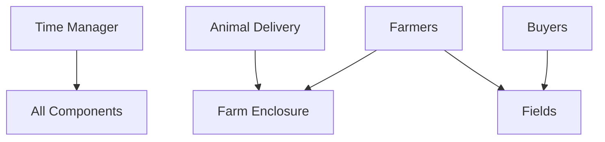
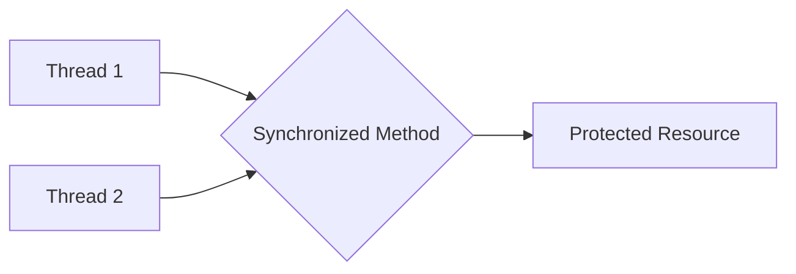
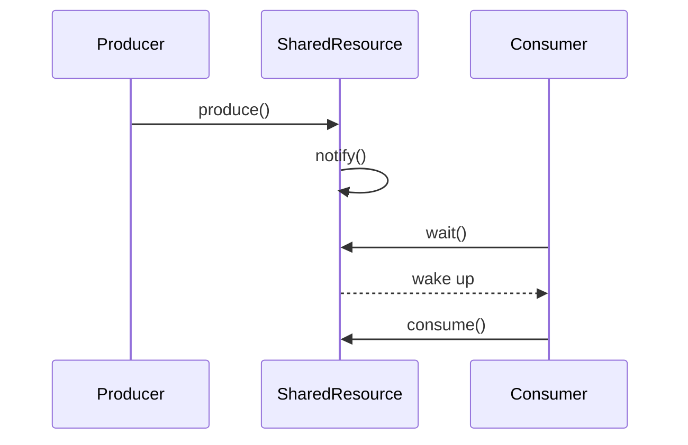

# Farm Simulation Design Documentation

## 1. List of Working Functionality

| Feature | Status | Description |
|---------|--------|-------------|
| Time Management | Working | Simulation clock that advances in ticks and allows threads to wait for specific durations |
| Animal Delivery | Working | Periodic delivery of random assortments of animals to the farm enclosure |
| Farmer Collection | Working | Farmers collect animals from the enclosure and transport them to appropriate fields |
| Field Management | Working | Fields store animals of specific types with proper synchronization |
| Buyer Collection | Working | Buyers periodically take animals from their preferred fields |
| Synchronization | Working | Thread-safe operations on shared resources (enclosure and fields) |
| Logging | Working | Detailed event logging for tracking simulation activities |
| Field Capacity Limits | Working | Fields have a maximum capacity that cannot be exceeded |
| Fair Resource Access | Working | Prevention of starvation for farmers and buyers through proper synchronization |

## 2. Division of Work

The architecture follows a clean task-oriented division where each component has a well-defined responsibility:

- **TimeManager**: Manages the simulation clock and provides waiting functionality
- **Farm**: Central component coordinating enclosure and fields
- **Field**: Manages animal storage for a specific type with synchronized access
- **Farmer**: Collects animals from enclosure and stocks fields
- **Buyer**: Purchases animals from specific fields
- **AnimalDelivery**: Periodically adds new animals to the enclosure
- **Logger**: Provides thread-safe logging functionality

## 3. Running the Code

### Compilation
To compile the code on Linux/Ubuntu:

```bash
cd /path/to/CSC1101_Multithread_Farm
javac *.java
```

### Running
To run the simulation:

```bash
java FarmSimulation [tickTimeMs] [numFarmers] [fieldCapacity]
```

### Parameters
- **tickTimeMs**: Duration of each tick in milliseconds (default: 100ms)
- **numFarmers**: Number of farmer threads (default: 3)
- **fieldCapacity**: Maximum capacity of each field (default: 100)

Example:
```bash
java FarmSimulation 50 5 200
```
This runs the simulation with 50ms ticks, 5 farmers, and field capacity of 200.

## 4. Tasks and Dependencies

The simulation consists of several concurrent tasks with dependencies:



### Task Relationships
- **Time Management**: All components depend on the TimeManager to coordinate actions and simulate passing time
- **Animal Flow**: Animals flow from Delivery → Enclosure → Farmers → Fields → Buyers
- **Resource Management**: Enclosure and Fields are shared resources requiring synchronized access

## 5. Concurrency Patterns and Strategies

### Synchronized Methods
The design uses Java's `synchronized` methods extensively to protect shared resources:



- **Farm**: Uses synchronized methods to protect the enclosure
- **Field**: Uses synchronized methods to protect animal lists within each field

### Wait/Notify Pattern
The solution implements the Producer-Consumer pattern using Java's wait-notify mechanism:



Examples:
- **Farm.waitForAnimals()**: Farmers wait until animals are available in the enclosure
- **Field.takeAnimal()**: Buyers wait until animals are available in a field

### Explicit Locking
For more complex synchronization needs, we use explicit locking:

- **Field.lockForStocking()**: Farmers exclusively lock a field during stocking operations

## 6. Addressing Concurrency Issues

### Starvation Prevention
The implementation prevents starvation through several mechanisms:

- **Farmer Collection**: Uses a fair approach to collect animals, preventing any one farmer from monopolizing the enclosure
- **Field Access**: Uses notification to all waiting threads (`notifyAll()`) when resources become available
- **Field Locking**: Farmers try to acquire locks but don't block indefinitely, allowing others to attempt access

### Fairness
Fairness is maintained through:

- **Resource Distribution**: Animal delivery distributes animals randomly across types
- **Farmer Priority**: Farmers prioritize fields with most animals, balancing the workload
- **Wait Notification**: All waiting threads are notified when resources change, avoiding preferential treatment

### Deadlock Prevention
The design prevents deadlocks by:

- **Resource Ordering**: Resources are always accessed in a consistent order
- **Non-Blocking Attempts**: Using `tryLock()` with retries rather than blocking indefinitely
- **Single Lock Acquisition**: Avoiding nested lock acquisitions where possible

### Race Condition Prevention
Race conditions are prevented by:

- **Atomic Operations**: Critical sections are fully contained within synchronized blocks
- **State Protection**: All shared state is accessed only through synchronized methods
- **Conditional Waiting**: Using wait/notify with proper condition checking

## 7. Design Decisions and Reasoning

### Choice of Synchronization Mechanisms
- **Synchronized Methods**: Used for simple mutual exclusion needs due to their clarity and ease of use
- **wait/notify**: Used for condition-based synchronization where threads need to wait for state changes
- **Explicit Locking**: Used for operations that require more complex coordination

### Data Structures
- **ArrayList for Animals**: Simple to use and adequate for the expected workload
- **HashMap for Fields**: Provides fast access to fields by AnimalType

### Time Management
- **Tick-Based Simulation**: Provides a consistent time reference for all components
- **Central Time Manager**: Ensures all components have a synchronized view of time
- **Waiting Mechanism**: Allows components to wait for specific durations without busy-waiting

### Error Handling
- **Interrupt Handling**: All blocking operations properly handle thread interruption
- **Resource Management**: Fields prevent overflow by checking capacity before adding animals

### Scalability Considerations
- **Parameterized Threads**: Number of farmers is configurable
- **Configurable Capacities**: Field capacities can be adjusted based on system resources
- **Independent Buyers**: One buyer per animal type allows for parallel purchasing

## 8. Future Improvements

- **Shutdown Mechanism**: Implement clean shutdown of all threads
- **Performance Monitoring**: Add metrics collection for throughput and wait times
- **Dynamic Scaling**: Allow adjusting number of farmers and buyers during runtime
- **Resource Limits**: Add limits to the enclosure capacity
- **Advanced Animal Properties**: Extend animals with properties like age, health, etc.
- **UI Visualization**: Add a graphical interface to visualize the farm operation
