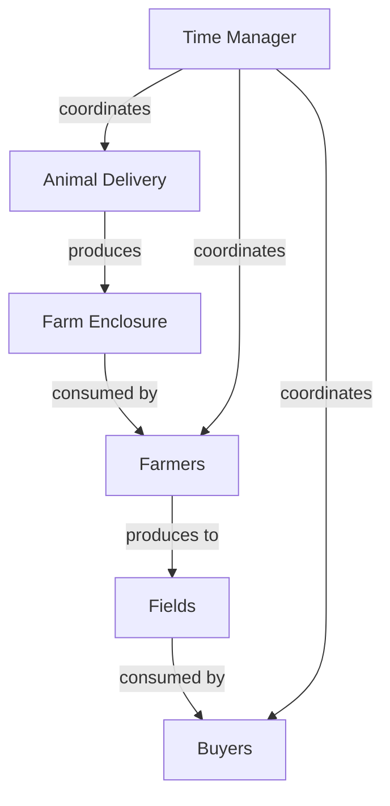
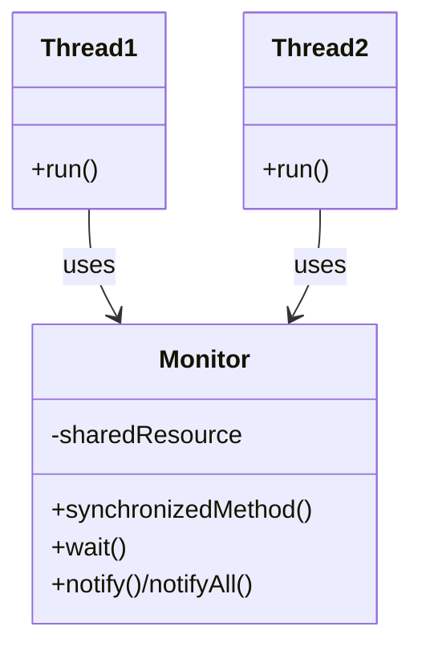

# Farm Simulation Design Documentation

## 1. List of Working Functionality

| Feature                 | Status  | Minimal                           | Good                                     | Description                                                   |
| ----------------------- | ------- | --------------------------------- | ---------------------------------------- | ------------------------------------------------------------- |
| Animal Delivery         | Working | 10 animals delivered periodically | Random distribution across types         | Delivery thread periodically adds animals to enclosure        |
| Multiple Farmers        | Working | Single farmer                     | Configurable number (default: 3)         | Multiple farmers collect and stock animals                    |
| Multiple Fields         | Working | 5 different animal types          | Limited capacity (configurable)          | Fields for each animal type with capacity limits              |
| Buyers                  | Working | One buyer per field type          | Buyers take animals at varying intervals | Buyers purchasing from their preferred fields                 |
| Configurable Parameters | Working | Tick time in ms                   | Number of farmers, Field capacity        | Command-line parameters to adjust simulation                  |
| Farmer Breaks           | Working | -                                 | Farmers take breaks (200-300 ticks)      | Farmers take periodic breaks to avoid resource monopolisation |
| Thread Safety           | Working | Basic synchronization             | Comprehensive thread safety              | All shared resources protected through synchronisation        |
| Farmer Prioritisation   | Working | N/A                               | Stock fields with most animals first     | Farmers prioritise fields with most animals                   |
| Logging                 | Working | Basic logging                     | Detailed event tracking                  | Thread-safe comprehensive logging system                      |

## 2. Division of Work

The work on this project was divided between two developers:

| Component/Task          | Developer 1 | Developer 2 |
| ----------------------- | ----------- | ----------- |
| TimeManager             | ✓           |             |
| Farm class              | ✓           |             |
| Field class             | ✓           |             |
| Animal class            |             | ✓           |
| AnimalType enum         |             | ✓           |
| Farmer implementation   |             | ✓           |
| Buyer implementation    |             | ✓           |
| Animal Delivery system  |             | ✓           |
| Logger implementation   | ✓           |             |
| Threading coordination  | ✓           |             |
| Synchronization design  | ✓           |             |
| Main simulation class   | ✓           | ✓           |
| Command-line parameters | ✓           |             |
| Documentation           |             | ✓           |
| Testing                 | ✓           | ✓           |

The architecture follows a clean separation of concerns principle, with each component responsible for a specific task:

1. **TimeManager**: Manages simulation time and provides synchronization points
2. **Farm**: Acts as the central coordinator between enclosure and fields
3. **Field**: Manages animals of a specific type with thread-safe access
4. **Farmer**: Collects animals from enclosure and stocks appropriate fields
5. **Buyer**: Takes animals from specific fields
6. **AnimalDelivery**: Delivers new animals to the enclosure
7. **Logger**: Provides thread-safe logging of simulation events

## 3. Running the Code

### Compilation

To compile the code on Linux/Ubuntu:

```bash
cd /path/to/CSC1101_Multithread_Farm
javac *.java
```

### Execution

To run the simulation with default parameters:

```bash
java FarmSimulation
```

### Parameters

The simulation accepts optional command-line parameters:

```bash
java FarmSimulation [tickTimeMs] [numFarmers] [fieldCapacity]
```

- **tickTimeMs**: Duration of each tick in milliseconds (default: 100ms)
- **numFarmers**: Number of farmer threads (default: 3)
- **fieldCapacity**: Maximum capacity of each field (default: 100)

Example with custom parameters:

```bash
java FarmSimulation 50 5 200
```

This runs the simulation with 50ms ticks, 5 farmers, and field capacity of 200.

## 4. Architecture and Flow

The farm simulation models a multi-threaded system with producers, consumers, and shared resources. The architecture is designed around the flow of animals through the system:



### Animal Flow

1. **Delivery**: Animals are periodically generated and delivered to the farm enclosure
2. **Collection**: Farmers collect animals from the enclosure
3. **Stocking**: Farmers transport animals to their appropriate fields
4. **Purchase**: Buyers take animals from their specialized fields

### Component Interactions

- **Producer-Consumer**: Multiple relationships (delivery-enclosure, farmers-fields, fields-buyers)
- **Shared Resources**: Enclosure and fields are accessed by multiple threads
- **Time Synchronization**: All components use the TimeManager for coordination

## 5. Concurrency Patterns and Strategies

### 5.1 Monitor Pattern

The implementation uses the monitor pattern extensively to protect shared resources and coordinate thread actions:



Examples in the code:

- **Farm** class acts as a monitor for the enclosure
- **Field** class acts as a monitor for field animals
- **TimeManager** acts as a monitor for simulation time

### 5.2 Lock-Based Synchronization

For complex operations requiring exclusive access:

```java
// Try to lock the field for stocking - non-blocking to prevent deadlock
while (!field.lockForStocking()) {
    Thread.sleep(10);
}
try {
    // Perform stocking operations
} finally {
    field.unlockStocking();
}
```

This pattern ensures:

- Exclusive access during multi-step operations
- Non-blocking behavior to prevent deadlocks
- Proper resource release using finally block

### 5.3 Immutability

For thread safety without synchronization:

```java
public class Animal {
    private final AnimalType type; // Immutable
    // ...
}
```

### 5.4 Producer-Consumer Pattern

Multiple producer-consumer relationships are implemented using wait/notify:


Examples:

- **AnimalDelivery** (producer) → **Farm Enclosure** → **Farmers** (consumer)
- **Farmers** (producer) → **Fields** → **Buyers** (consumer)

## 6. Addressing Concurrency Challenges

### 6.1 Deadlock Prevention

The implementation prevents deadlocks through several mechanisms:

1. **Resource Ordering**: Resources are always acquired in a consistent order

   ```java
   // Farmers sort fields before locking, ensuring consistent order
   sortedAnimals.sort((e1, e2) -> Integer.compare(e2.getValue().size(), e1.getValue().size()));
   ```

2. **Non-Blocking Lock Acquisition**: Farmers try to acquire field locks without blocking indefinitely

   ```java
   while (!field.lockForStocking()) {
       Thread.sleep(10);
   }
   ```

3. **Resource Release in Finally Blocks**: Ensuring resources are released even if exceptions occur
   ```java
   try {
       // Use the resource
   } finally {
       field.unlockStocking(); // Always release the lock
   }
   ```

### 6.2 Starvation Prevention

The design prevents thread starvation through:

1. **notifyAll() Instead of notify()**: Waking all waiting threads when a resource state changes

   ```java
   // In Field.addAnimal() - wakes all waiting buyers
   notifyAll();
   ```

2. **Fair Resource Distribution**: Farmers collect a limited number of animals each time

   ```java
   // MAX_ANIMALS constant limits how many animals a farmer can take at once
   private static final int MAX_ANIMALS = 10;
   ```

3. **Periodic Breaks**: Farmers take mandatory breaks, preventing resource monopolization
   ```java
   // Farmers take breaks every 200-300 ticks for 150 ticks
   if (currentTick - lastBreakTick >= ticksUntilNextBreak) {
       timeManager.waitTicks(BREAK_DURATION);
   }
   ```

### 6.3 Race Condition Prevention

Race conditions are prevented by:

1. **Synchronized Methods**: Atomic operations on shared state

   ```java
   public synchronized void addAnimalsToEnclosure(Map<AnimalType, Integer> animalCounts, long tick) {
       // Atomic operation on enclosure
   }
   ```

2. **Guarded Waiting**: Using while loops with wait() to handle spurious wakeups

   ```java
   while (enclosure.isEmpty()) {
       wait();
   }
   ```

3. **Volatile Variables**: For flags that need visibility across threads
   ```java
   private volatile boolean running = true;
   ```

### 6.4 Thread Coordination

The simulation uses the TimeManager as a central coordination point:

1. **Simulated Time**: Components wait for specific durations without busy-waiting

   ```java
   timeManager.waitTicks(travelTime);
   ```

2. **Condition Synchronization**: Using wait/notify for state-based coordination
   ```java
   // Wait until target tick is reached
   while (currentTick < targetTick) {
       wait();
   }
   ```

## 7. Design Decisions and Reasoning

### 7.1 Centralized Time Management

The TimeManager was designed as a separate component to:

- **Decouple Time from Logic**: Components don't need to track time themselves
- **Provide Consistent Time View**: All threads see the same simulation time
- **Enable Tick-Based Waiting**: Components can wait for specific durations without busy loops

This approach allows for clean coordination between threads and simulates real-world time dependencies.

### 7.2 Field Specialization

Each field handles only one animal type, which:

- **Simplifies Synchronization**: Reduces contention compared to a single shared field
- **Models Real-World**: Reflects actual farm organization
- **Enables Buyer Specialization**: Buyers can specialize in specific animal types

### 7.3 Farmer Breaks

Farmers take periodic breaks which:

- **Prevents Monopolization**: Ensures no single farmer dominates resources
- **Adds Realism**: Real workers take breaks
- **Improves Fairness**: Gives other farmers opportunities to access resources
- **Randomizes Timing**: Random break intervals prevent synchronized resource contention

### 7.4 Priority-Based Field Stocking

Farmers prioritize fields with most animals first:

```java
// Sort by number of animals to stock most populated fields first
sortedAnimals.sort((e1, e2) -> Integer.compare(e2.getValue().size(), e1.getValue().size()));
```

This decision:

- **Optimizes Field Utilization**: Handles larger collections first
- **Improves Efficiency**: Empties farmer inventory faster
- **Reduces Latency**: Animals get to fields quicker

### 7.5 Non-Blocking Field Lock

The non-blocking approach to field locking:

```java
while (!field.lockForStocking()) {
    Thread.sleep(10);
}
```

This pattern:

- **Prevents Deadlocks**: No circular wait conditions can occur
- **Improves Responsiveness**: Farmers can attempt other tasks if a field is busy
- **Reduces Contention**: Short sleep reduces CPU usage during polling

### 7.6 Simulation Parameters

Making key parameters configurable:

- **Improves Flexibility**: Allows experimentation with different settings
- **Enables Performance Testing**: Can adjust parameters to find optimal configurations
- **Facilitates Learning**: Shows effects of different thread counts and resource capacities

## 8. Limitations and Future Improvements

### 8.1 Current Limitations

1. **No Shutdown Mechanism**: The simulation runs indefinitely
2. **Limited Statistics**: No built-in performance metrics collection
3. **Fixed Animal Types**: Animal types are hardcoded as an enum

### 8.2 Potential Improvements

1. **Graceful Shutdown**: Implement a clean shutdown procedure
2. **Performance Metrics**: Add statistics collection for wait times, throughput, etc.
3. **Dynamic Animal Properties**: Add more properties to animals (age, weight, etc.)
4. **UI Visualization**: Add a graphical representation of the farm
5. **Advanced Scheduling**: Implement more sophisticated scheduling for farmers

### 8.3 Configuration File Support

A future improvement would be supporting a configuration file:

```java
public class SimulationConfig {
    public static Properties loadConfig(String filename) {
        // Load configuration from file
    }
}
```

This would allow more detailed configuration without recompilation.

## 9. Conclusion

The farm simulation demonstrates a multi-threaded system with shared resources, multiple producers and consumers, and complex coordination requirements. The implementation showcases:

- **Monitor Pattern**: For thread-safe access to shared resources
- **Producer-Consumer Pattern**: For transferring animals through the system
- **Resource Locking**: For complex operations requiring exclusive access
- **Fair Scheduling**: To prevent resource monopolization and starvation

The design prioritizes:

- **Thread Safety**: Preventing race conditions and data corruption
- **Deadlock Prevention**: Ensuring the simulation doesn't halt unexpectedly
- **Fairness**: Ensuring all threads get reasonable access to resources
- **Configurability**: Allowing experimentation with different parameters
