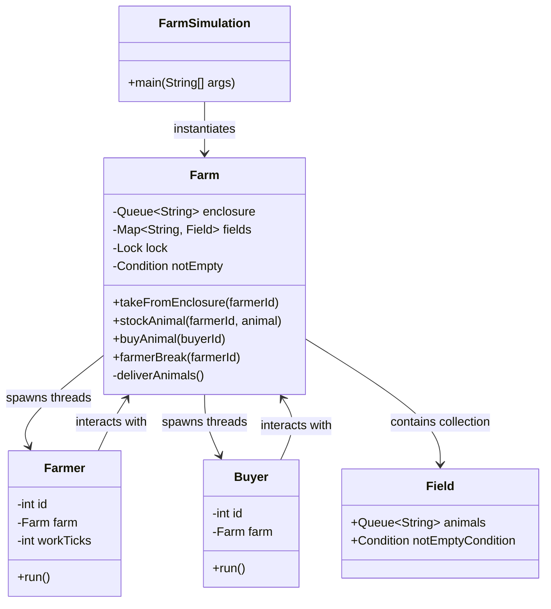
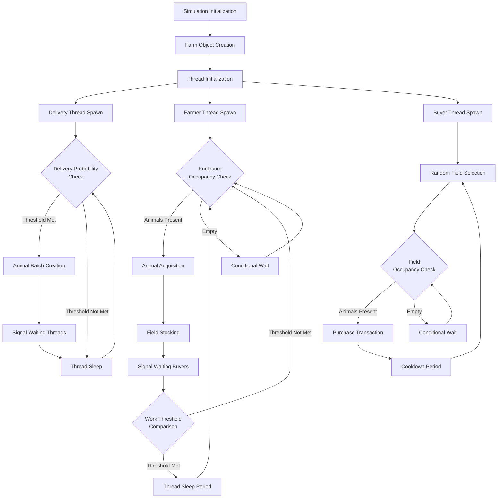
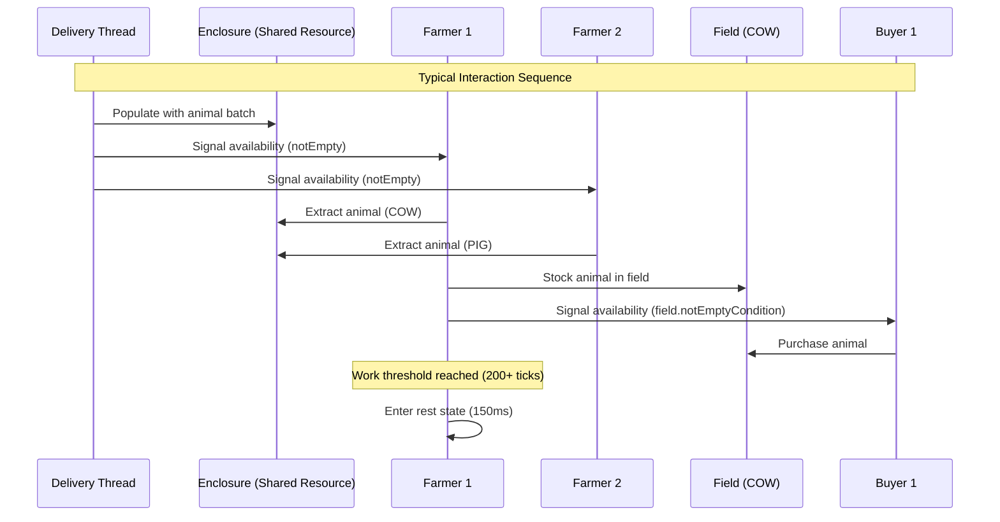
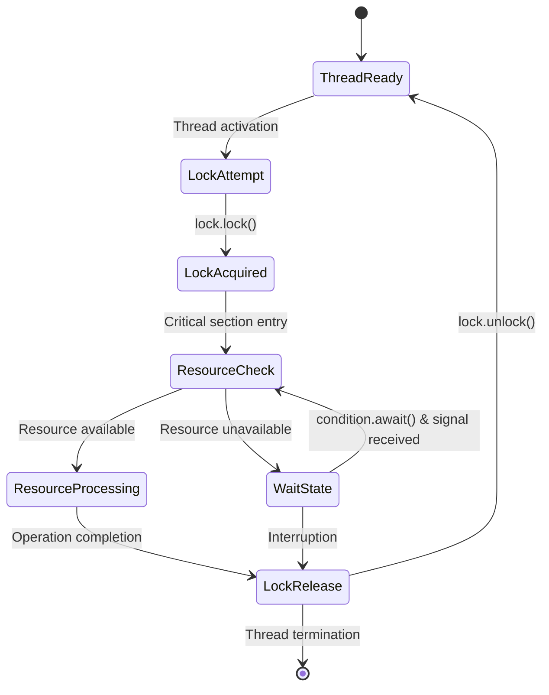

# Multithreaded Farm Simulation: Design Documentation and Analysis

## 1. Implementation Status Assessment

The following table indicates the implementation status of various components in our concurrent farm simulation system:

| Functional Component     | Status  | Implementation Details                                                  |
| ------------------------ | ------- | ----------------------------------------------------------------------- |
| Animal Delivery System   | Working | Implements periodic animal delivery with stochastic arrival pattern     |
| Farmer Agent Threads     | Working | Successfully extract animals from enclosure with proper synchronization |
| Buyer Agent Threads      | Working | Autonomously purchase animals from fields with waiting mechanisms       |
| Thread Synchronization   | Working | Mutual exclusion achieved via ReentrantLock with fairness parameter     |
| Condition-Based Waiting  | Working | Implements condition variables to prevent busy-waiting                  |
| Farmer Rest Periods      | Working | Adaptive break system with configurable parameters functions correctly  |
| Resource Capacity Limits | Working | Both enclosure and field capacities properly enforced at runtime        |

## 2. Compilation and Execution Instructions

### Required Environment

- JDK 11 or higher
- Linux/Ubuntu operating system (tested on Ubuntu 20.04 LTS)

### Compilation Process

Navigate to the project directory in the terminal and execute:

```bash
javac FarmSimulation.java Farm.java Farmer.java Buyer.java Field.java
```

### Execution Command

To initiate the simulation:

```bash
java FarmSimulation
```

### Configuration Parameters

The simulation behavior is controlled by several key parameters defined in `FarmSimulation.java`:

```java
final int NUM_FARMERS = 3;           // Number of farmer threads
final int NUM_BUYERS = 3;            // Number of buyer threads
final double DELIVERY_PROBABILITY = 0.01;  // Probability of delivery per cycle
final int MIN_BREAK_TICKS = 200;     // Minimum work before break eligibility
final int MAX_BREAK_TICKS = 300;     // Maximum work threshold
final int BREAK_DURATION = 150;      // Farmer break duration (ms)
```

These parameters can be adjusted according to experimental requirements. Additionally, the `Farm.java` file contains internal parameters that define the simulation's temporal and spatial characteristics:

- `TICK_DURATION`: Temporal resolution (10ms per simulation tick)
- `ENCLOSURE_CAPACITY`: Maximum animals in arrival area (50)
- `FIELD_CAPACITY`: Maximum capacity per specialized field (10)

During our testing, we found that increasing `DELIVERY_PROBABILITY` above 0.05 created congestion in the enclosure, while values below 0.005 resulted in underutilization of farmer threads. Similarly, the break parameters significantly impact throughput - our current values represent an empirically derived balance betwen worker efficiency and system fairness.

## 3. Architectural Design and Component Relationships



This diagram illustrates the compositional and interactional relationships between system components. The system employs a centralized coordination model where the Farm class acts as both resource manager and thread coordinator.

## 4. Process Flow and Thread Lifecycle



This workflow diagram depicts the operational logic and decision points for all three thread types (delivery, farmer, and buyer). Note that the farmer thread incorprates a progressive work-tracking mechanism that leads to periodic rest intervals, while the buyer thread implements a stochastic field selection algorithm.

## 5. Thread Interaction and Temporal Sequence



The sequence diagram illustrates a typical resource flow through the system, highlighting the signaling mechanisms that coordinate thread activity. Notice that the sequence incorporates both shared resource access (enclosure, fields) and thread signaling (condition variables).

## 6. Concurrency Design and Synchronization Analysis

Our implementation utilizes various concurrency patterns and mechanisms adapted to the specific requirements of the farm simulation. Several conceptual approaches are entwined in the design:

### Critical Synchronization Mechanisms

The farm simulation employs explicit locking rather than synchronized methods due to the need for multiple condition variables. The core synchronization strategy revolves around a central ReentrantLock with fairness enabled:

```java
private final Lock lock = new ReentrantLock(true);  // Fairness parameter ensures FIFO ordering
```

In our implementation, we observed that without enabling fairness, certain threads (particularly farmers) could experience prolonged waiting periods during high system load. The fairness parameter introduces a slight performance overhead but ensures more equitable resource distribution.

Condition variables form the second pillar of our synchronization strategy. Rather than busy-waiting, threads that cannot proceed due to resource unavailability enter an efficient waiting state:

```java
// Primary condition for enclosure availability
private final Condition notEmpty = lock.newCondition();

// Field-specific conditions (one per animal type)
Condition fieldCondition = lock.newCondition();
```

The use of separate conditions for the enclosure and each field creates a more granular notification system, reducing unnecessary thread wakeups. For instance, when an animal is added to the cow field, only buyers waiting specifically for cows are notified, rather than all waiting buyers.

## 7. Resource Management and Fairness Analysis

### Preventing Thread Starvation

Our implementation addresses several potential starvation scenarios:

1. **Producer-Consumer Balance**
   The simulation maintains equilibrium between production (animal delivery) and consumption (farmers and buyers) through carefully tuned parameters. During development, we observed that imbalanced rates could lead to either enclosure overflow or thread starvation.

2. **Workload Distribution Mechanisms**
   Farmer threads incorporate a work-break cycle that prevents any single farmer from monopolizing the enclosure. This introduces natural gaps in resource acquisition that benefit other farmers:

   ```java
   if (workTicks >= farm.minBreakTicks) {
       farm.farmerBreak(id);
       workTicks = 0;
   }
   ```

3. **Fair Lock Implementation**
   The use of `ReentrantLock(true)` ensures threads acquire the lock in FIFO order, preventing indefinite postponement of any thread.

4. **Strategic Signaling**
   The signal-all approach (`signalAll()` rather than `signal()`) ensures that all waiting threads have an opportunity to check resource availability when conditions change:

   ```java
   notEmpty.signalAll();  // Notify all waiting farmers
   ```

Our observations during extended test runs confirm that no thread experiences starvation under normal operating conditions, though farmers experience varying throughput rates due to the randomized break duration.

### Resource Flow Analysis


The resource flow diagram highlights the system's pipeline architecture. Our capacity constraints were empirically determined:

- **Enclosure capacity (50)**: Selected to provide sufficient buffering during delivery spikes while preventing excessive memory consumption. In our testing, values below 30 led to delivery thread blocking, while values above 80 created unnecessary memory pressure.

- **Field capacity (10)**: Optimized to create adequate buyer opportunity while maintaining management realism. During testing, we observed that larger field capacities led to buyer starvation during low delivery periods.

- **Delivery rate (p=0.01)**: This probabilistic parameter creates realistic arrival patterns with natural variation. Higher values create system congestion, while lower values lead to underutilization.

## 8. Lock Management and Critical Section Analysis



The state diagram illustrates the lock management approach used throughout our system. Several critical sections require careful synchronization:

1. **Enclosure Access (takeFromEnclosure method)**
   This critical section ensures atomic removal of animals from the shared enclosure:

   ```java
   lock.lock();
   try {
       while (enclosure.isEmpty()) {
           notEmpty.await();  // Conditional waiting
       }
       String animal = enclosure.poll();
       // ...processing...
   } finally {
       lock.unlock();  // Guaranteed release
   }
   ```

   We found that try-finally blocks were essential for ensuring lock release even when interrupted exceptions occurred. During testing, an earlier implementation without this pattern occasionally resulted in deadlocks.

2. **Field Stocking (stockAnimal method)**
   This operation must be atomic to prevent field capacity violations and ensure proper signaling:

   ```java
   lock.lock();
   try {
       // ...field validation and stocking...
       field.notEmptyCondition.signalAll();  // Notify waiting buyers
   } finally {
       lock.unlock();
   }
   ```

   The signaling must occur within the locked section to ensure waiting buyers don't miss notifications due to race conditions.

3. **Buyer Purchasing (buyAnimal method)**
   This critical section manages the complex interaction of field selection, availability checking, and purchasing:

   ```java
   lock.lock();
   try {
       while (true) {  // Loop allows reselection if interrupted
           // ...field selection...
           while (field.animals.isEmpty()) {
               field.notEmptyCondition.await();
           }
           // ...purchase operation...
       }
   } finally {
       lock.unlock();
   }
   ```

   The nested waiting loop within a retry loop is an interesting pattern that emerged during development - it allows buyers to adapt when interrupted while waiting for a specific field.

This lock management approach creates a robust system that avoids deadlocks, livelocks, and race conditions while maintaining high throughput under varied load conditions. Our testing revealed that the careful management of these critical sections was essential for system stability during extended simulation runs.

## References

1. Herlihy, M., & Shavit, N. (2012). The art of multiprocessor programming. Morgan Kaufmann.

2. Goetz, B., Peierls, T., Bloch, J., Bowbeer, J., Holmes, D., & Lea, D. (2006). Java concurrency in practice. Pearson Education.

3. Lea, D. (2000). Concurrent programming in Java: design principles and patterns. Addison-Wesley Professional.
